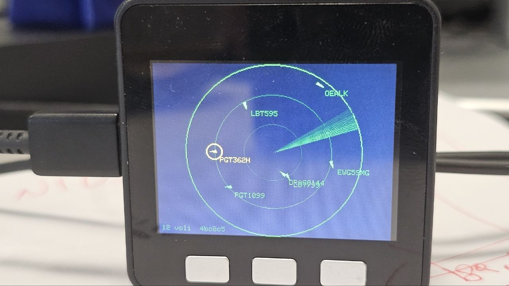
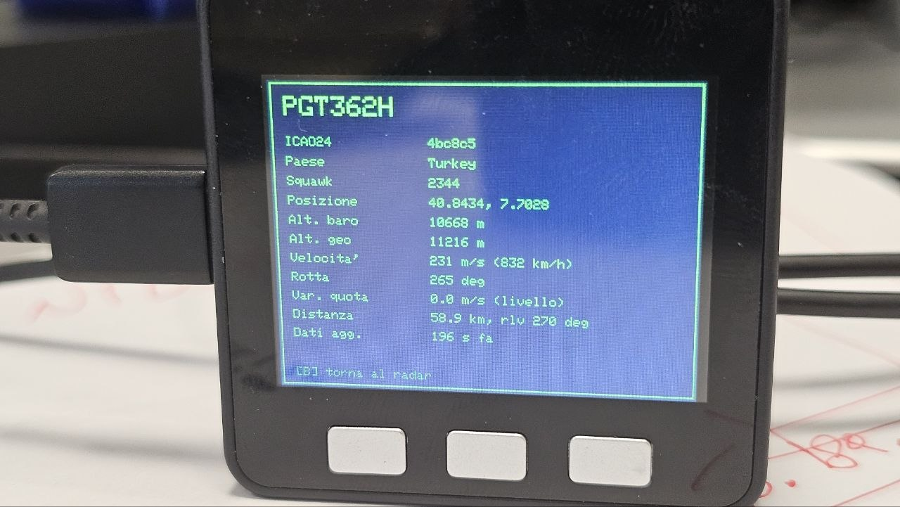

# M5Stack Flight Radar

Un piccolo flight radar da scrivania per **M5Stack**, che mostra in tempo reale gli aerei sopra la tua posizione usando i dati di [OpenSky Network](https://opensky-network.org).

Il progetto è un adattamento compatto — un singolo file `.ino` di circa 200 righe — del bellissimo [micro-radar](https://github.com/AnthonySturdy/micro-radar) di Anthony Sturdy, originariamente scritto per un modulo ESP32-C3 con display GC9A01 tondo e basato su PlatformIO. Questa versione gira sui dispositivi M5Stack standard (Core, Core2, CoreS3, Fire) usando Arduino IDE, e sfrutta i tre pulsanti frontali per una navigazione interattiva tra gli aerei rilevati.

<p align="center">
  
  &nbsp;&nbsp;
  
</p>

## Caratteristiche

- **Vista radar** con cerchi concentrici, sweep animato con scia e triangoli orientati sulla rotta reale di ciascun aereo
- **Predizione della posizione** (dead reckoning) tra un fetch e l'altro basata su velocità e rotta
- **Blending smooth** ease-in-out quando arrivano nuovi dati, per evitare salti bruschi
- **Selezione e dettagli**: cicla tra gli aerei sullo schermo e apri una schermata con tutte le informazioni disponibili
- **Distanza e rilevamento** dal centro radar calcolati con la formula haversine
- **Auto-tuning** della frequenza di refresh in base al budget giornaliero dell'API OpenSky (400 richieste anonime, 4000 autenticate)

## Hardware richiesto

Qualunque dispositivo M5Stack con display integrato e tre pulsanti frontali:

- M5Stack Core / Core2 / CoreS3 / Fire

Su Core2 e CoreS3, che hanno lo schermo touch al posto dei pulsanti fisici, M5Unified mappa automaticamente `BtnA/B/C` sulle tre zone touch sotto il display.

## Comandi

| Tasto | Vista radar | Vista dettagli |
|-------|-------------|----------------|
| **A** (sinistro) | Cicla tra gli aerei visibili sullo schermo (il selezionato viene evidenziato in giallo con un doppio anello) | — |
| **B** (centrale) | Apre i dettagli dell'aereo selezionato | Torna alla vista radar |
| **C** (destro) | Forza il refresh immediato dei dati OpenSky | — |

## Installazione

### 1. Arduino IDE

Serve Arduino IDE 2.x. Aggiungi l'URL del package M5Stack in *File → Preferences → Additional Boards Manager URLs*:

```
https://static-cdn.m5stack.com/resource/arduino/package_m5stack_index.json
```

Poi in *Tools → Board → Boards Manager* installa il package **M5Stack** e seleziona la board corretta (M5Core, M5Core2, M5CoreS3, ...).

### 2. Librerie

Da *Sketch → Include Library → Manage Libraries* installa:

- **M5Unified** (di M5Stack)
- **ArduinoJson** v7 (di Benoit Blanchon)

### 3. Configurazione

Apri `M5Radar.ino` e modifica la sezione di configurazione in testa al file:

```cpp
const char* WIFI_SSID   = "TUO_SSID";
const char* WIFI_PASS   = "TUA_PASSWORD";
const double LAT        = 0.0000;     // latitudine del centro radar
const double LON        = 0.0000;      // longitudine del centro radar
const double RAD        = 1.0;         // raggio in gradi (max 2)
const char* OSKY_ID     = "";          // opzionale
const char* OSKY_SECRET = "";          // opzionale
```

### 4. Account OpenSky (consigliato)

Con un account gratuito su [opensky-network.org](https://opensky-network.org) le richieste giornaliere passano da 400 a 4000, che si traduce in aggiornamenti ogni ~22 secondi invece di ogni ~3,5 minuti. Le credenziali si trovano nelle impostazioni dell'account.

## Crediti

- Progetto originale [micro-radar](https://github.com/AnthonySturdy/micro-radar) di [Anthony Sturdy](https://github.com/AnthonySturdy) — rilasciato sotto licenza MIT
- Dati di volo forniti da [OpenSky Network](https://opensky-network.org)
- Librerie [M5Unified](https://github.com/m5stack/M5Unified) e [ArduinoJson](https://arduinojson.org)

## Licenza

MIT — vedi il file [LICENSE](LICENSE) del progetto originale.
